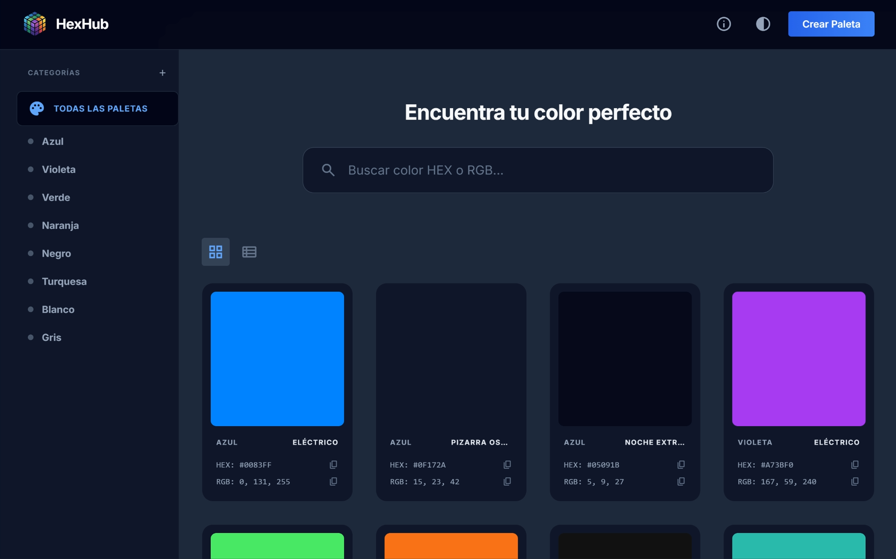

# HexHub

Generador y organizador de paletas de colores profesional

<div align="center">
  
</div>

<div align="center">
  
  
  
</div>

## Acerca del Proyecto

HexHub es una herramienta diseñada para desarrolladores y diseñadores que buscan una forma eficiente de gestionar sus paletas de colores. Permite generar nuevas combinaciones, organizar colores por categorías personalizadas y tener siempre a mano los códigos Hex y RGB necesarios para cualquier proyecto web, todo bajo una interfaz elegante y minimalista.

## Características Principales

* **Gestión de Colores:** Guarda y organiza tus colores favoritos en categorías personalizadas.
* **Generación Dinámica:** Explora nuevas tonalidades y combinaciones de manera rápida.
* **Copiado Inteligente:** Copia códigos Hex y RGB al portapapeles con un solo clic.
* **Modo Oscuro:** Interfaz moderna que se adapta a tus preferencias visuales.
* **Persistencia Local:** Almacenamiento local mediante un servidor Node.js para mantener tus datos seguros.

## Captura de Pantalla



## Tecnologías Utilizadas

* [HTML5](https://developer.mozilla.org/es/docs/Web/HTML)
* [CSS3](https://developer.mozilla.org/es/docs/Web/CSS) - Tailwind CSS
* [JavaScript](https://developer.mozilla.org/es/docs/Web/JavaScript) - ES6+
* [Node.js](https://nodejs.org/) - Express.js para persistencia de datos


## Estructura del Proyecto

```text
HexHub/
├── assets/
│   ├── data/
│   │   └── data.json
│   ├── icons/
│   │   └── logo.ico
│   └── images/
│       └── logo.png
├── src/
│   ├── css/
│   │   └── styles.css
│   └── js/
│       ├── app.js
│       └── script.js
├── index.html
├── server.js
├── server.bat
└── README.md
```

## Instalación y Uso

1. Clona el repositorio:
   ```bash
   git clone https://github.com/ricard020/colores.git
   ```
2. Instala las dependencias:
   ```bash
   npm install
   ```
3. Inicia el servidor local:
   - **Opción A:** Ejecuta el archivo `server.bat` (solo Windows).
   - **Opción B:** Ejecuta el comando `npm start`.
4. Abre `http://localhost:3000` en tu navegador.

## Autor

- **Ricardo** - [GitHub](https://github.com/ricard020)

## Licencia

Este proyecto se encuentra bajo la Licencia MIT.
